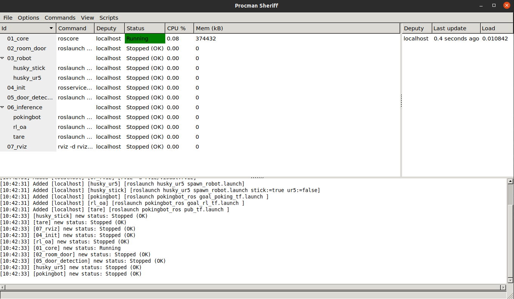
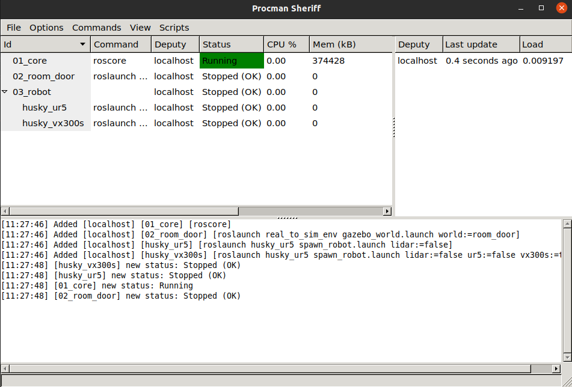
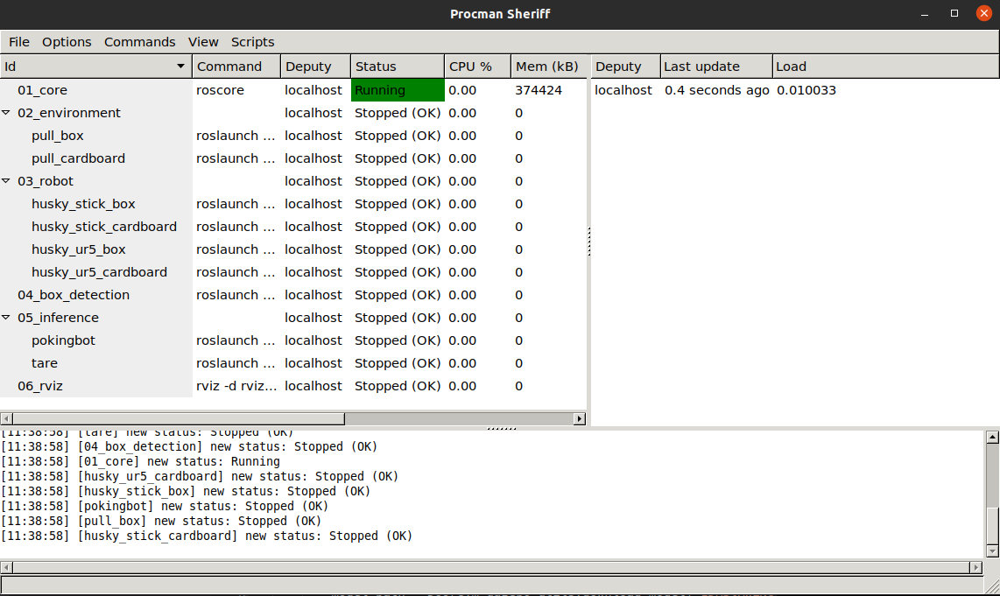
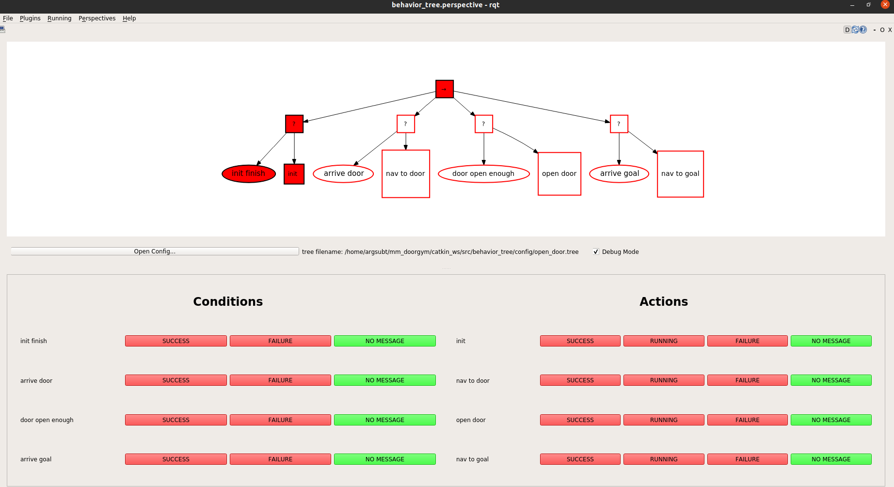

# mm_doorgym

## Clone repo 

Deep Reinforcement Learning-based Mobile Manipulator
Controls for Interactive Navigation through Doors in Hardware
in the Loop Simulation and Real World Environments

```
git clone --recursive git@github.com:ARG-NCTU/mm_doorgym.git
```

## Set up the Docker 

The all required environment was organized, only need laptop or computer with GPU, and make sure install docker already.

### How to use

We released docker images for developer that can modifiy other packages on this and compile by yourself.

1. Docker Run

    Run this script to pull docker image to your workstation, **if your gpu is 20 series GPU, please edit docker image label from rtx30 to latest in docker_run.sh and docker_join.sh**.

    ```
    source docker_run.sh
    ```
2. Docker Join

    If want to enter same docker image, type below command.

    ```
    source docker_join.sh
    ```
3. Catkin_make

    Execute compile script in the first time, then the other can ignore this step.
    ```
    source catkin_make.sh
    ``` 

4. setup environment

    Make sure run this command when the terminal enter docker. 
    ```
    source environment.sh
    ```

## Experiment1

We arranged all command in procman, easy to inference our proposed method and Run other baseline.

### Step1. Open procman window
```
source docker_run.sh
source catkin_make.sh
source environment.sh
source start_ex1.sh
```
After open procman, you will see below window.


The useful command for procman list below.
- Run(ctrl＋s)
- Stop(ctrl＋t)
- ReRun(ctrl+r)

### Step2. Inference

* RL_oa

    Following it order to run command, 03_robot select **husky_ur5** and 06_inference chose **rl_oa**.

* TARE

    Following it order to run command, 03_robot select **husky_ur5** and 06_inference chose **tare**.

    Open one terminal to run tare algorithm.
    ```
    cd [path/to/autonomous_exploration_development_environment]
    source docker_run.bash
    catkin_make
    source environment.sh
    roslaunch vehicle_simulator husky_tare.launch opened:=false normal:=false ignored:=true
    ```

* Pokingbot

    Following it order to run command, 03_robot select **husky_stick** and 06_inference chose **pokingbot**.

Then open two termianl, one is set goal, the other one is replace joystick to control robot, **if you have joystick, you can ignore this step**.

1. One termianl
    ```
        source docker_join.sh
        source environment.sh
    ```
    - set right goal
    
        You can use 2D Nav Goal in Rviz or use command to decide.
        ```
            rostopic pub /move_base_simple/goal geometry_msgs/PoseStamped "header:
            seq: 0
            stamp:
                secs: 0
                nsecs: 0
            frame_id: 'map'
            pose:
            position:
                x: 8.0
                y: 8.5
                z: 0.13225967565936952
            orientation:
                x: 0.0
                y: 0.0
                z: 0.0
                w: 1"
        ```
    - set left goal
    
        You can use 2D Nav Goal in Rviz or use command to decide.
        ```
            rostopic pub /move_base_simple/goal geometry_msgs/PoseStamped "header:
            seq: 0
            stamp:
                secs: 0
                nsecs: 0
            frame_id: 'map'
            pose:
            position:
                x: 10.25
                y: 8.52
                z: 0.13225967565936952
            orientation:
                x: 0.0
                y: 0.0
                z: 0.0
                w: 1"
        ```
2. Two terminal
    
    **If use joystick, you can ignore this step**.

    Please make sure the navigation goal was set.
    ```
        source docker_join.sh
        source environment.sh
    ```

    - Start 
        
        **If use joystick, press start to run**.

        Using below command to replace joystick control.
        ```
            rostopic pub /robot/joy_teleop/joy sensor_msgs/Joy '{ header: {seq: 10, stamp: {secs: 1431222430, nsecs: 345678}, frame_id: "3"}, axes: [1.0, 0.0, 0.0, 0.0, 0.0, 0.0], buttons: [0, 0, 0, 0, 0, 0, 0, 1, 0, 0, 0, 0, 0, 0]}'
        ```

    - Stop

        **If use joystick, press back to stop**.

        Using below command to replace joystick control.
        ```
            rostopic pub /robot/joy_teleop/joy sensor_msgs/Joy '{ header: {seq: 10, stamp: {secs: 1431222430, nsecs: 345678}, frame_id: "3"}, axes: [1.0, 0.0, 0.0, 0.0, 0.0, 0.0], buttons: [0, 0, 0, 0, 0, 0, 1, 0, 0, 0, 0, 0, 0, 0]}'
        ```

* DoorGym

    Following it order to run command, 03_robot select **husky_ur5** and 06_inference chose **tare**.

    Please manual comment 134 rows and uncomment 135 rows on [state_machine_ex1.py](https://github.com/kuolunwang/DoorGym/blob/master/catkin_ws/src/doorgym/src/state_machine_ex1.py)


* RL_mm(Ours)

    Following it order to run command, 03_robot select **husky_ur5** and 06_inference chose **tare**.

    Please manual comment 135 rows and uncomment 134 rows on [state_machine_ex1.py](https://github.com/kuolunwang/DoorGym/blob/master/catkin_ws/src/doorgym/src/state_machine_ex1.py)

Then open two termianl, one is run open_door algorithm, and the other one is open tare to navigate door and goal.

1. One terminal for tare

    ```
    cd [path/to/autonomous_exploration_development_environment]
    source docker_run.bash
    catkin_make
    source environment.sh
    roslaunch vehicle_simulator husky_tare.launch opened:=true normal:=false ignored:=false
    ```
2. Second terminal for dooropen

    ```
    cd [path/to/DoorGym]
    source docker_run.sh
    source catkin_make.sh
    source environment.sh
    roslaunch doorgym door_open.launch state:=true
    ```

## Experiment2

We arranged all command in procman, easy to inference our proposed method and Run other baseline.

### Step1. Open procman window
```
source docker_run.sh
source catkin_make.sh
source environment.sh
source start_ex2.sh
```
After open procman, you will see below window.


The useful command for procman list below.
- Run(ctrl＋s)
- Stop(ctrl＋t)
- ReRun(ctrl+r)

### Step2. Inference

* UR5

    Following it order to run command, 03_robot select **husky_ur5**.

    Open one terminal to run door open.

    - For 6 joints
        ```
        cd [path/to/DoorGym]
        source docker_run.sh
        source catkin_make.sh
        source environment.sh
        roslaunch doorgym door_open.launch state:=false ur5:=true 3dof:=false
        ```
    - For 3 DOF
        ```
        cd [path/to/DoorGym]
        source docker_run.sh
        source catkin_make.sh
        source environment.sh
        roslaunch doorgym door_open.launch state:=false ur5:=true 3dof:=true
        ```

* VX300s

    Following it order to run command, 03_robot select **husky_vx300s**.

    Open one terminal to run door open.

    - For 6 joints
        ```
        cd [path/to/DoorGym]
        source docker_run.sh
        source catkin_make.sh
        source environment.sh
        roslaunch doorgym door_open.launch state:=false ur5:=false 3dof:=false
        ```
    - For 3 DOF
        ```
        cd [path/to/DoorGym]
        source docker_run.sh
        source catkin_make.sh
        source environment.sh
        roslaunch doorgym door_open.launch state:=false ur5:=false 3dof:=true
        ```

## Experiment3

We arranged all command in procman, easy to inference our proposed method and Run other baseline.

### Step1. Open procman window
```
source docker_run.sh
source catkin_make.sh
source environment.sh
source start_ex2.sh
```
After open procman, you will see below window.


The useful command for procman list below.
- Run(ctrl＋s)
- Stop(ctrl＋t)
- ReRun(ctrl+r)

### Step2. Inference 

* Box

    - Pokingbot

        Following it order to run command, 02_environment select **pull_box**, 03_robot select **husky_stick_box**, 05_inference select **pokingbot**.

        Open two terminal to set goal and enable robot to navigate goal, the related code can refer above.

    - DoorGym

        Following it order to run command 01 to 03, 02_environment select **pull_box**, 03_robot select **husky_ur5_box**, then run pull code to remove box out of passage.

        Please manual comment 46 and 110 rows and uncomment 47 and 108 rows on [inference_pull.py](https://github.com/kuolunwang/DoorGym/blob/master/catkin_ws/src/doorgym/src/inference_pull.py)

        ```
        cd [path/to/DoorGym]
        source docker_run.sh
        source catkin_make.sh
        source environment.sh
        roslaunch doorgym pull_box.launch 3dof:=false
        ```

        Then the fininsh pull box task, keep it order to execute 04 to 06, 05_inference select **tare**.

        Open one terminal to run tare algorithm.

        ```
        cd [path/to/autonomous_exploration_development_environment]
        source docker_run.bash
        catkin_make
        source environment.sh
        roslaunch vehicle_simulator husky_tare.launch opened:=false normal:=true ignored:=false
        ```

    - 6 joints

        The steps are same as DoorGym, only edit some code.

        Please manual comment 47 and 110 rows and uncomment 46 and 108 rows on [inference_pull.py](https://github.com/kuolunwang/DoorGym/blob/master/catkin_ws/src/doorgym/src/inference_pull.py)

    - 3 DOF

        The steps are same as DoorGym, only edit some code.

        Please manual comment 110 rows and uncomment 108 rows on [inference_3dof_pull.py](https://github.com/kuolunwang/DoorGym/blob/master/catkin_ws/src/doorgym/src/inference_3dof_pull.py)

        Replace pull code below.
        ```
        cd [path/to/DoorGym]
        source docker_run.sh
        source catkin_make.sh
        source environment.sh
        roslaunch doorgym pull_box.launch 3dof:=true
        ```


* Cardboard

    The all steps are same as box, before you execute it, please manual comment 108 rows and uncomment 110 rows on [inference_pull.py](https://github.com/kuolunwang/DoorGym/blob/master/catkin_ws/src/doorgym/src/inference_pull.py) and comment 108 rows and uncomment 110 rows on [inference_3dof_pull.py](https://github.com/kuolunwang/DoorGym/blob/master/catkin_ws/src/doorgym/src/inference_3dof_pull.py).

    Then 02_environment select **pull_cardboard**.

    - For the Pokingbot

        The 03_robot select **husky_stick_cardboard**.

    - For the other

        The 03_robot select **husky_ur5_cardboard**

## Behavior Tree

Apart from the smach, I also use behavior tree to infer this task, below example for husky ur5 3 dof push task.

```
source docker_run.sh
source catkin_make.sh
source environment.sh
source start_ex1.sh
```
After open procman, you will see below window.


The useful command for procman list below.
- Run(ctrl＋s)
- Stop(ctrl＋t)
- ReRun(ctrl+r)

Following it order to run command, 03_robot select **husky_ur5** and 06_inference chose **tare**.

Open one terminal to open behavior tree.

```
source docker_join.sh
source environment.sh
roslaunch behavior_tree behavior_tree.launch
```

you will see below gui, then press "Open Config..." and select open_door.tree, select Debug Mode will show below test button.


Then open two termianl, one is run open_door algorithm, and the other one is open tare to navigate door and goal.

1. One terminal for tare

    ```
    cd [path/to/autonomous_exploration_development_environment]
    source docker_run.bash
    catkin_make
    source environment.sh
    roslaunch vehicle_simulator husky_tare.launch opened:=true normal:=false ignored:=false
    ```
2. Second terminal for dooropen

    ```
    cd [path/to/DoorGym]
    source docker_run.sh
    source catkin_make.sh
    source environment.sh
    roslaunch doorgym door_open_bt.launch
    ```