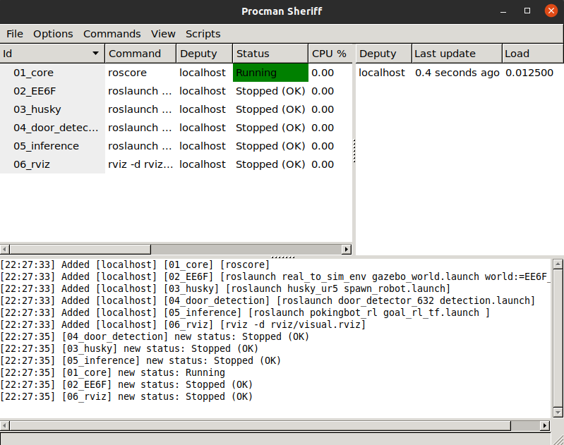
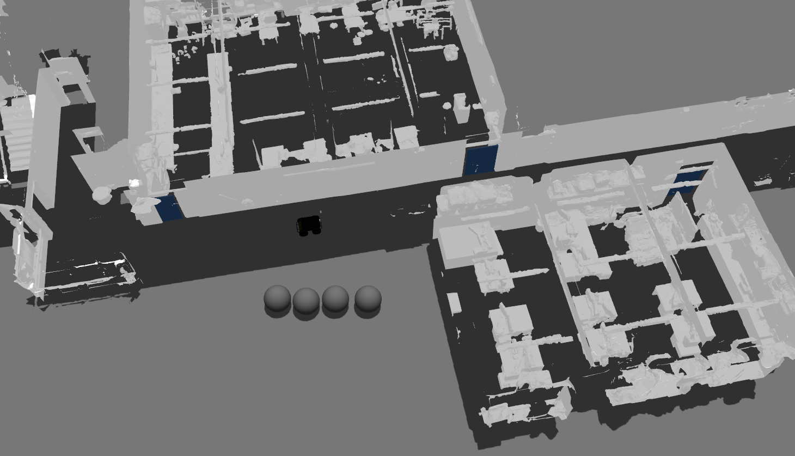
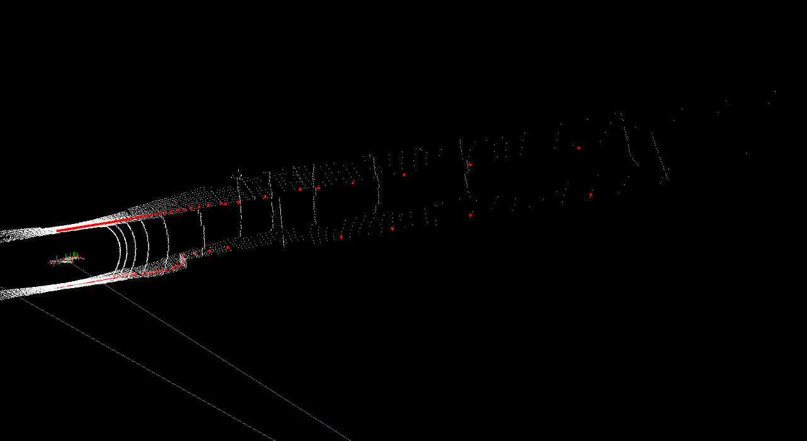

# pokingbot


PokingBot : Enabling Real-world Interactive Navigation via
Curriculum Reinforcement Learning for Search and Rescue Missions

## Clone repo
```
    git clone --recursive git@github.com:ARG-NCTU/pokingbot.git
```

## Download pretrained weight and mesh file

Please manual download [pretrained weight](https://drive.google.com/drive/folders/1ZND9f0_t7W-6U3cFv8tmFs50dQQBadG8?usp=sharing) to pokingbot/catkin_ws/src/pokingbot_rl/model and [mesh file](https://drive.google.com/file/d/19Z9GJjG-H34WpE_lON0qYFkzD-fb7x_j/view?usp=sharing) to pokingbot/catkin_ws/src/real_to_sim_env/mesh.

**After download mesh finished, recommend delete all jpg file in EE6F/mesh, avoid GPU run out of space**. 

## Set up the Docker 

The all required environment was organized, only need laptop or computer with GPU, and make sure install docker already.

### How to use

1. Docker Run

    Run this script to pull docker image to your workstation, **if your gpu is 30 series GPU, please edit docker image label from latest to rtx30 in docker_run.sh and docker_join.sh**.
    ```
        source docker_run.sh
    ```
2. Docker Join

    If want to enter same docker image, type below command.
    ```
        source docker_join.sh
    ```
3. Catkin_make

    Execute compile script in the first time, then the other can ignore this setp.
    ```
        source catkin_make.sh
    ``` 

4. setup environment

    Make sure run this command when the terminal enter docker. 
    ```
        source environment.sh
    ```

## Navigation in Matterport3D Counterpart 

We arranged all command in procman, easy to inference our proposed method and Run our Matterport3D Counterpart environment.

### Open procman window
```
    source docker_run.sh
    source catkin_make.sh
    source environment.sh
    source start_EE6F.sh
```

After open procman, you will see below window.


Then following this order to run(ctrl + s), the other useful command list below.
- Run(ctrl＋s)
- Stop(ctrl＋t)
- ReRun(ctrl+r)

### Inference

After run all program, you can see gazebo and rviz like below picture.



Then open two termianl, one is set goal, inital robot position and set door angle, the other one is replace joystick to control robot, **if you have joystick, you can ignore this step**.
1. One termianl
    ```
        source docker_join.sh
        source environment.sh
    ```
    - set goal
    
        You can use 2D Nav Goal in Rviz or use command to decide.
        ```
            rostopic pub /move_base_simple/goal geometry_msgs/PoseStamped "header:
            seq: 0
            stamp:
                secs: 0
                nsecs: 0
            frame_id: 'map'
            pose:
            position:
                x: 22.443239247165142
                y: -28.656319762302733
                z: 0.13225967565936952
            orientation:
                x: 0.0
                y: 0.0
                z: 0.0
                w: 1"
        ```
    - init robot

        You can use move in gazebo to move robot or use command to set.
        ```
            rosservice call /gazebo/set_model_state "model_state:
            model_name: 'robot'
            pose:
                position:
                x: 27.4999959616
                y: -23.471198697
                z: 0.132260098029
                orientation:
                x: 2.75171907041e-05
                y: -4.34359624021e-06
                z: -0.999997186395
                w: 0.00237200905826
            twist:
                linear:
                x: 0.0
                y: 0.0
                z: 0.0
                angular:
                x: 0.0
                y: 0.0
                z: 0.0
            reference_frame: ''"
        ```

    - init door

        You can decide door angle by using this command.
        ```
            rosservice call /gazebo/set_model_configuration "model_name: 'hinge_door_1.2_1'
            urdf_param_name: 'robot_description'
            joint_names:
            - 'hinge'
            joint_positions:
            - 0"
        ```
2. Two terminal
    
    **If use joystick, you can ignore this step**.

    Please make sure the navigation goal was set.
    ```
        source docker_join.sh
        source environment.sh
    ```

    - Start 
        
        **If use joystick, press start to run**.

        Using below command to replace joystick control.
        ```
            rostopic pub /robot/joy_teleop/joy sensor_msgs/Joy '{ header: {seq: 10, stamp: {secs: 1431222430, nsecs: 345678}, frame_id: "3"}, axes: [1.0, 0.0, 0.0, 0.0, 0.0, 0.0], buttons: [0, 0, 0, 0, 0, 0, 0, 1, 0, 0, 0, 0, 0, 0]}'
        ```

    - Stop

        **If use joystick, press back to stop**.

        Using below command to replace joystick control.
        ```
            rostopic pub /robot/joy_teleop/joy sensor_msgs/Joy '{ header: {seq: 10, stamp: {secs: 1431222430, nsecs: 345678}, frame_id: "3"}, axes: [1.0, 0.0, 0.0, 0.0, 0.0, 0.0], buttons: [0, 0, 0, 0, 0, 0, 1, 0, 0, 0, 0, 0, 0, 0]}'
        ```
        
<!-- ## Navigation in Virtual DARPA Subt Challenge -->


