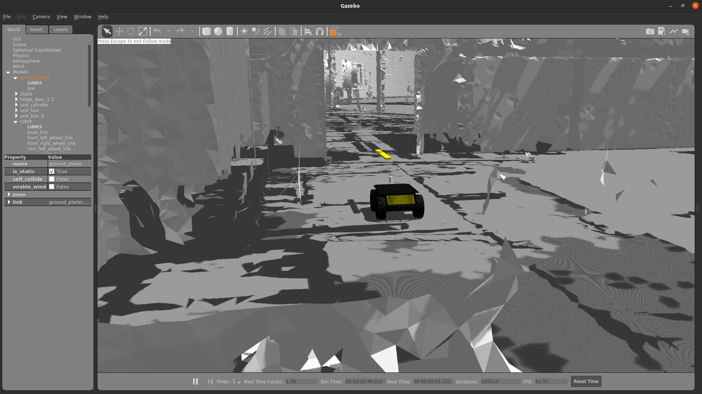
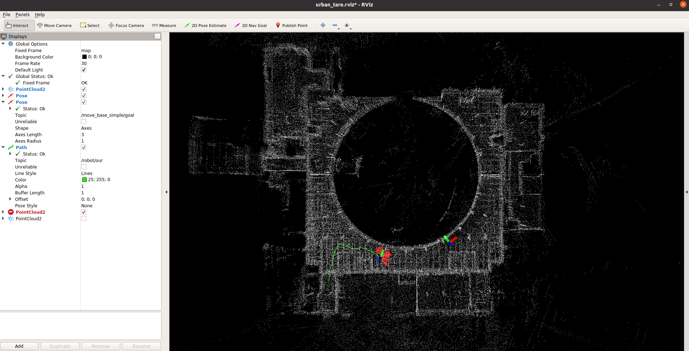

# pokingbot


PokingBot : Enabling Real-world Interactive Navigation via
Curriculum Reinforcement Learning for Search and Rescue Missions

## Clone Tare repo
```
$ git clone git@github.com:ARG-NCTU/autonomous_exploration_development_environment.git
```

## Set up the Docker

The all required environment was organized, only need laptop or computer with GPU, and make sure install docker already.

## pokingbot Repo for environment and robot setup

1. Docker Run

    Run this script to pull docker image to your workstation, **if your gpu is 30 series GPU, please edit docker image label from latest to rtx30 in docker_run.sh and docker_join.sh**.

    ```
    pokingbot $ source docker_run.sh
    ```

2. Docker Join

    If want to enter same docker image, type below command.

    ```
    pokingbot $ source docker_join.sh
    ```

3. setup environment

    Make sure run this command when the terminal enter docker.
    ```
    Docker $ source environment.sh
    ```

## Navigation in Virtual DARPA Subt Challenge using TARE 

### Open procman window
```
Docker $ source environment.sh
Docker $ source start_urban_tare.sh
```

After open procman, you will see below window pop up.
After run all program, you can see gazebo and rviz like below picture.



### RUN TARE
```
IPC $ cd ~/autonomous_exploration_development_environment 
IPC $ source docker_run.sh
TARE Docker $ source environment.sh
TARE Docker $ roslaunch vehicle_simulator husky_tare.launch
```

### Set Goal

```
Docker $ source docker_join.sh
Docker $ source environment.sh
```

You can use **2D Nav Goal in Rviz** or use command to decide.
```
rostopic pub /move_base_simple/goal geometry_msgs/PoseStamped "header:
seq: 0
stamp:
    secs: 0
    nsecs: 0
frame_id: 'map'
pose:
    position:
        x: 38.391566381540294
        y: 10.515670567702028
        z: 0.1322596572889722
    orientation:
        x: 0.0
        y: 0.0
        z: 0.0
        w: 1"
```
    
### Joystick and Autonomous

**If you use a joystick, you can ignore this step**.

Please make sure the navigation goal was set.
```
Docker $ source docker_join.sh
Docker $ source environment.sh
```
- Start

    **If use joystick, press start to run**.

    Using below command to replace joystick control.
    ```
    rostopic pub /robot/joy_teleop/joy sensor_msgs/Joy '{ header: {seq: 10, stamp: {secs: 1431222430, nsecs: 345678}, frame_id: "3"}, axes: [1.0, 0.0, 0.0, 0.0, 0.0, 0.0], buttons: [0, 0, 0, 0, 0, 0, 0, 1, 0, 0, 0, 0, 0, 0]}'
    ```

- Stop

    **If use joystick, press back to stop**.

    Using below command to replace joystick control.
    ```
    rostopic pub /robot/joy_teleop/joy sensor_msgs/Joy '{ header: {seq: 10, stamp: {secs: 1431222430, nsecs: 345678}, frame_id: "3"}, axes: [1.0, 0.0, 0.0, 0.0, 0.0, 0.0], buttons: [0, 0, 0, 0, 0, 0, 1, 0, 0, 0, 0, 0, 0, 0]}'
    ```
## Example
